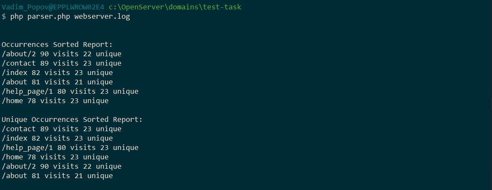

Contents
* EN Section
* RU Section

## EN Section

### Installation and launch

Run composer
```
>composer install
```
Application launch
```
>php parser.php webserver.log
```
The result of the program work:



Running Tests
```
>vendor\bin\phpunit tests
```
### Architecture and design

I decided to issue the result of solving the test problem in the form of a simple CLI application in php. I approached the solution in terms of application architecture. I considered that an important point for the architecture of this functionality is its extensibility. Example: Today we read from a .log file and display it on the screen, but tomorrow we may need to read from an .xml file and send it by email.

The source code of the files is located:
```
src/LogParser
```
It consists of a folder with interfaces and three logical components:
* **Readers** - classes for reading data for the log. Now it is LogReader.php, which reads data from the log file line by line. In its interface, I put only the implementation of \IteratorAggregate, so that it would be possible to iterate through all the lines of the file as follows:
```php
foreach ($this->reader as $logLine) {
    $this->parseLogLine($logLine);
}
```
* **ReportProviders** - They encapsulate the logic about how to provide the information that we have in the repository. Currently there are 2 files:
  * ReportProvider.php - displays the report using echo.
  Usage:
  ```php
  $logParser->provideOccurrencesSortedReport(new LogParser\ReportProviders\ReportProvider());
  ```
    The result can be seen on the screenshot.
  
  * ReportAsStringProvider.php - returns the report as a string.
  ```php
  $report = $logParser->provideOccurrencesSortedReport(new LogParser\ReportProviders\ReportAsStringProvider());
  ```
  The contents of the $report variable:
  ```
    /about/2 90 visits 22 unique, /contact 89 visits 23 unique, /index 82 visits 23 unique, /about 81 visits 21 unique, /help_page/1 80 visits 23 unique, /home 78 visits 23 unique
  ```
* **Model** - work with data. It consists of the LogReport.php file, which works with the minimal entities of our parser - log lines. And the file LogStorage.php - entity store

I want to dwell on the application model in more detail.

## Model and TDD

The model is the heart of this application. I started with it when creating the application. Used TDD rapid development technique. It was a cyclical process of stages:
* Test
* Implementation
* Debugging

The tests are in the folder
```
tests
```

### LogRecord.php

I started with the LogRecord.php entity

This entity stores a log for each link.
```php
Class LogRecord implements Interfaces\LogRecord, Interfaces\StatisticsProvider {
    protected $id;
    protected $ipList = [];
    
    // ...
}
```
* $id - entity identifier (link).
* $ipList - List of ip addresses that visited this link in the form:
```php
[
    <ip> => <number of visits>,
    ...
]
```
The stages of entity development can be traced by tests:
1. testConstructor - we test the creation of an entity, as a result of creation we should have an entity with:
    * given $id
    * with number of occurrences = 1
    * with number of unique occurrences = 1
2. testConstructorException - we are testing the creation of an entity with input data - an incorrectly formatted string. As a result, you should get an error.
3. testAddAdditionalRecord - test for adding a new entry to the log. In this case, the number of all occurrences and unique occurrences must be correctly counted.
4. testGetStatistics - test for getting statistics. This test has an interesting story. When I sent the code, it seemed strange to me that the number of unique occurrences is always 2. But in a hurry I decided that this is a feature of the dataset. In the morning when I started writing this guide, I decided to rewrite the test and check it. I changed it so that 3 unique occurrences are expected and it gave an error. I found and fixed the error, which consisted in: When adding new entries there was a typo and id was used instead of ip.
5. testGetIdFromLogLine - a test of a static method that parses a log line and returns an identifier. This method is used to check if an entity with the same id already exists or not.

### LogStorage.php

The class that is responsible for storing and sorting LogRecord entities. Implements the \IteratorAggregate interface.

When designing the repository and managing entities, the task arose in tracking the uniqueness of entities. I thought about creating a factory that would keep track of existing entities and return them, or create new ones. But i didn't like this idea. It turns out that the storage functionality is duplicated and the responsibilities of the factory are mixed. It must both store and create.

As a result, I decided to use the YAGNI principle and not to produce unnecessary entities, but to use a simple and easily tested interface and logic:
- Check if an entity with the same ID exists in the repository
- If not, then create a new one.
- If there is, get it and add a new occurrence.

Stages of class development by tests:
* testAddDifferentLogRecords - testing adding 2 entities with different IDs. We expect the correct total number of entities.
* testSameLogRecords - testing adding two entities with the same identifier. Expected result - Exception.
* testCheckIfIdExists - method check that returns true/false depending on whether there is an entity with the same id in the storage. We check on two cases. When the entity exists and when it doesn't.
* testGetLogRecordById - testing the method for returning an entity by ID.

In addition, there are 2 more methods that sort the set of entities either by the number of all occurrences, or by the number of unique occurrences.

## Final, class LogParser.php

LogParser.php class - collects and uses all other classes that I wrote about above.
Objects with the LogReader and LogStorage interfaces are passed to the constructor.
Right there in the constructor, we go through all the log entries and parse them into entities that we add to LogStorage.

After the constructor completes, we have an object of the LogParser class that has already parsed all the log entries and stores them in the LogStorage instance.

It remains only to display the report using the provideOccurrencesSortedReport (sorted by the number of occurrences) or provideUniqueOccurrencesSortedReport (sorted by the number of unique occurrences) methods

These methods expect an object as a parameter that implements the LogReportProvider interface and controls how the report will be generated.

Using the LogParser.php class is in a file
```
parser.php
```
In addition, class contains error logging and the ability to output errors list.

## RU Section

### Установка и запуск

Запуск composer
```
>composer install
```
Запуск приложения
```
>php parser.php webserver.log
```
    
Результат работы программы:


Запуск тестов
```
>vendor\bin\phpunit tests
```
### Архитектура и дизайн

Результат решения тестовой задачи я решил оформить в виде простого CLI приложение на php. Я подошел к решению с точки зрения архитектуры приложения. Посчитал что важным моментом для архитектуры этого функционала является его расширяемость. Сегодня мы считываем с .log файла и выводим на экран, но завтра нам может понадобиться, например, считывать с .xml файла и отправлять по email.

Исходный код файлов находится по пути:
```
src/LogParser
```
Он состоит из папки с интерфейсами и трёх логических составляющих:
* **Readers** - классы для считывания данных для лога. Сейчас это LogReader.php, который считывает данные с лог файла построчно. В его интерфейс я заложил только реализацию \IteratorAggregate, чтобы было возможно итерацией пройти по всем строкам файла следующим образом:
```php
foreach ($this->reader as $logLine) {
    $this->parseLogLine($logLine);
}
```
* **ReportProviders** - поставщики отчетов. В них инкапсулирована логика о том каким образом предоставить информацию, что у нас есть в хранилище. На текущий момент это 2 файла:
  * ReportProvider.php - выводит на экран отчет используя echo.
  Использование:
  ```php
  $logParser->provideOccurrencesSortedReport(new LogParser\ReportProviders\ReportProvider());
  ```
  Результат можно увидеть на скрине:

  

  * ReportAsStringProvider.php - возвращает отчет в виде строки.
  ```php
  $report = $logParser->provideOccurrencesSortedReport(new LogParser\ReportProviders\ReportAsStringProvider());
  ```
  Содержимое переменной $report:
    ```
    /about/2 90 visits 22 unique, /contact 89 visits 23 unique, /index 82 visits 23 unique, /about 81 visits 21 unique, /help_page/1 80 visits 23 unique, /home 78 visits 23 unique
    ```
* **Model** - работа с данными. Состойит из файла LogReport.php, который работает с минимальными сущностями нашего парсера - строками лога, и хранилища сущностей LogStorage.php

На модели приложения я хочу остановиться подробнее.

## Model and TDD

Модель - сердце этого приложения. Я начал с неё при создании приложения. Использовал TDD технику быстрой разработки. Это был цикличный процесс из этапов:
* Тест
* Реализация
* Отладка

Тесты находятся в папке
```
tests
```

### LogRecord.php

Начал я с сущности LogRecord.php

В этой сущности хранится лог по каждой ссылке. 
```php
Class LogRecord implements Interfaces\LogRecord, Interfaces\StatisticsProvider {
    protected $id;
    protected $ipList = [];
    
    // ...
}
```
* $id - идентификатор сущности (ссылка).
* $ipList - Список ip адресов, что заходили на эту ссылку в виде:
```php
[
    <ip> => <number of visits>,
    ...
]
```
Этапы разработки сущности можно проследить по тестам:
1. testConstructor - тестируем создание сущности, в результате создания у нас должна быть сущность с:
   * заданным $id
   * c количеством вхождений = 1
   * с количеством уникальных вхождений = 1
2. testConstructorException - тестируем создание сущности с входными данными - неправильно отформатированной строкой. В результате должны получить ошибку.
3. testAddAdditionalRecord - тест добавления нового вхождения в лог. В этом случае должно правильно подсчитываться количество всех вхождений и уникальных вхождений.
4. testGetStatistics - тест получения статистики. С этим тестом получилась интересная история. Когда я отправлял код, мне показалось странным что количество уникальных вхождений всегда равно 2. Но в спешке решил что это особенность набора данных. С утра, когда я принялся писать это руководство, я решил переписать тест и проверить. Я его изменил таким образом чтобы ожидалось 3 уникальных вхождения и он выдал ошибку. Я исправил ошибку, которая заключалась в том что при добавлении нового вхождений была опечатка и вместо ip использовался id.
5. testGetIdFromLogLine - тест статичного метода, что разбирает строку лога и возвращает идентификатор. Этот метод используется для проверки существует ли уже сущность с таким идентификатором или нет.

### LogStorage.php

Класс что отвечает за хранение и сортировку сущностей LogRecord. Реализует интерфейс \IteratorAggregate.

При проектировании хранилища и управления сущностями появилась задача в отслеживании уникальности сущностей. Размышлял над созданием фабрики, что отслеживала бы существующие сущности и возвращала бы их, или создавала бы новые. Но эта идея не понравилась. Получается что функционал по хранению дублируется и смешиваются ответственности фабрики. Она должна и хранить и создавать.

В итоге решил воспользоваться принципом YAGNI и не плодить лишних сущностей, а воспользоваться простым и легко тестируемым интерфейсом и логикой:
- Проверяем если сущность с таким идентификатором есть в хранилище
- Если нет, то создаем новую
- Если есть, получаем её и добавляем новое вхождение.

Этапы разработки класса по тестам:
* testAddDifferentLogRecords - тестирование добавления 2 сущностей с разными идентификаторами. Проверяем чтобы общее количество сущностей было ожидаемым.
* testSameLogRecords - тестирование добавления два раза сущности с одним идентификатором. Ожидаемый результат - Исключение.
* testCheckIfIdExists - проверка метода что возвращает true/false в зависимости от того есть ли сущность с таким id в хранилище. Проверяем на двух случаях. Когда сущность есть и когда нет.
* testGetLogRecordById - тестирование метода возвращения сущности по идентификатору.

Кроме этого есть еще 2 метода что сортируют набор сущностей либо по количеству всех вхождений, либо по количеству уникальных вхождений.

## Финал, класс LogParser.php

Класс LogParser.php - собирает и использует все другие классы, о которых я писал выше. 
В конструктор ему передаются объекты с интерфейсами LogReader и LogStorage.
Тут же в конструкторе проходим по всем записям лога и парсим их на сущности, что добавляем в LogStorage.

После завершения работы конструктора у нас есть объект класса LogParser что уже разобрал все записи лога и хранит их в экземпляре LogStorage.

Осталось только вывести отчет методами provideOccurrencesSortedReport (отсортированный по количеству вхождений) или provideUniqueOccurrencesSortedReport (отсортированный по количеству уникальных вхождений)

Эти методы ожидают в качестве параметра объект, что реализует интерфейс LogReportProvider и управляет способом, каким будет отдаваться отчет.

Использование класса LogParser.php в файле
```
parser.php
```
Кроме этого в этот класс добавлено логирование ошибок и возможность их вывода.